# Complete Order Flow — Entry & Exit Paths

This document describes how any order (entry or exit) enters your system from all possible sources (webhook, TradingView, dashboard, strategies, risk manager, etc.), how it flows through intent generation, persistence in `orders.db`, risk checks, broker submission, watcher reconciliation, and final orderbook display. It includes a full diagram and step-by-step explanations, verification commands, log locations, and references to key files.

---

**Files referenced:**
- [shoonya_platform/execution/order_watcher.py](shoonya_platform/execution/order_watcher.py)
- [shoonya_platform/persistence/repository.py](shoonya_platform/persistence/repository.py)
- [shoonya_platform/persistence/database.py](shoonya_platform/persistence/database.py)
- [shoonya_platform/api/dashboard/api/router.py](shoonya_platform/api/dashboard/api/router.py)
- [shoonya_platform/execution/intent_tracker.py](shoonya_platform/execution/intent_tracker.py)
- `verify_orders.py` (project root)

---

## 1. Full system diagram (Mermaid)

```mermaid
%%{init: {"securityLevel":"loose"}}%%
graph TD
    subgraph ENTRY_SOURCES["🟢 ENTRY SOURCES"]
        E1["🌐 WebHook<br/>Webhook Receiver<br/>TradingView/Custom"]
        E2["📱 Dashboard<br/>Manual Order<br/>Place Order Form"]
        E3["🤖 Strategy<br/>Automated Signal<br/>ScriptMaster"]
        E4["📊 Option Chain<br/>Strike Selection<br/>Dashboard UI"]
        E5["🔄 Position Adjust<br/>System Rebalance<br/>Internal Signal"]
    end
    
    subgraph ENTRY_PROCESSING["⚙️ ENTRY PROCESSING PIPELINE"]
        E_PARSER["Parser<br/>Normalize Input<br/>Validate Fields"]
        E_INTENT["Create Intent<br/>UniversalOrderCommand<br/>execution_type=ENTRY"]
        E_DB_WRITE["📝 DB Write<br/>Status: CREATED<br/>orders.db insert"]
        E_RMS_CHECK["🔍 RMS Check<br/>Daily Loss Limit<br/>Position Limits<br/>Capital Reserve<br/>Margin Available"]
    end
    
    subgraph EXIT_SOURCES["🔴 EXIT SOURCES"]
        X1["🚨 RMS Auto-Exit<br/>Max Daily Loss<br/>Max Position Size<br/>Margin Call"]
        X2["⏹️ Manual Exit<br/>Dashboard Button<br/>Close Position"]
        X3["🎯 Target Hit<br/>Automated Target<br/>Price Reached"]
        X4["🛑 Stop Loss Hit<br/>Automated SL<br/>Price Breached"]
        X5["📅 Time-based Exit<br/>End of Day<br/>Expiry Closure"]
        X6["🌐 WebHook Exit<br/>External Signal<br/>TradingView Exit"]
        X7["🔄 Trail Stop Hit<br/>Trailing SL<br/>Price Reversed"]
        X8["📊 Rebalance Exit<br/>Strategy Rebalance<br/>Position Adjust"]
    end
    
    subgraph EXIT_PROCESSING["⚙️ EXIT PROCESSING PIPELINE"]
        X_PARSER["Parser<br/>Normalize Exit Signal<br/>Identify Position"]
        X_INTENT["Create Intent<br/>UniversalOrderCommand<br/>execution_type=EXIT"]
        X_DB_WRITE["📝 DB Write<br/>Status: CREATED<br/>orders.db insert"]
        X_RMS_CHECK["🔍 RMS Check<br/>Position Exists<br/>Exit Quantity Valid<br/>Price Reasonable"]
    end
    
    E1 --> E_PARSER
    E2 --> E_PARSER
    E3 --> E_PARSER
    E4 --> E_PARSER
    E5 --> E_PARSER
    
    X1 --> X_PARSER
    X2 --> X_PARSER
    X3 --> X_PARSER
    X4 --> X_PARSER
    X5 --> X_PARSER
    X6 --> X_PARSER
    X7 --> X_PARSER
    X8 --> X_PARSER
    
    E_PARSER --> E_INTENT
    X_PARSER --> X_INTENT
    
    E_INTENT --> E_DB_WRITE
    X_INTENT --> X_DB_WRITE
    
    E_DB_WRITE --> E_RMS_CHECK
    X_DB_WRITE --> X_RMS_CHECK
    
    subgraph RISK_DECISION["🔒 RISK MANAGEMENT DECISION"]
        RMS_PASS["✅ RMS PASS"]
        RMS_BLOCK_E["🚫 RMS BLOCK<br/>Insurance Triggered<br/>Call Manual Action"]
        RMS_BLOCK_X["🚫 RMS BLOCK<br/>Position Invalid<br/>Call Manual Action"]
    end
    
    E_RMS_CHECK -->|PASS| RMS_PASS
    E_RMS_CHECK -->|FAIL| RMS_BLOCK_E
    X_RMS_CHECK -->|PASS| RMS_PASS
    X_RMS_CHECK -->|FAIL| RMS_BLOCK_X
    
    subgraph EXECUTION_GUARD["⚔️ EXECUTION GUARD<br/>Conflict Detection"]
        GUARD["Check:<br/>• No duplicate orders<br/>• No conflicting qty<br/>• Not in exit-all mode"]
    end
    
    RMS_PASS --> GUARD
    
    subgraph BROKER_LAYER["🚀 BROKER EXECUTION LAYER"]
        BROKER_SEND["Send to Broker<br/>Shoonya API Call<br/>Status: SENT_TO_BROKER<br/>broker_order_id assigned"]
        BROKER_PROCESS["⏳ Broker Processing<br/>Market Matching<br/>Execution Engine"]
    end
    
    GUARD -->|PASS| BROKER_SEND
    BROKER_SEND --> BROKER_PROCESS
    
    subgraph WATCHER_LAYER["👀 ORDER WATCHER<br/>Continuous Polling<br/>Every 1-2 seconds"]
        WATCHER_POLL["Poll Broker<br/>Get Order Status<br/>Fill Shares<br/>Avg Price<br/>Rejection Reason"]
        WATCHER_RECONCILE["Reconcile Status<br/>Update DB<br/>Execute Guard<br/>Clear Symbol State"]
    end
    
    BROKER_PROCESS --> WATCHER_POLL
    WATCHER_POLL --> WATCHER_RECONCILE
    
    subgraph FINAL_STATUS["✅ FINAL ORDER STATUS"]
        EXECUTED["✅ EXECUTED<br/>Status: EXECUTED<br/>Filled Qty Recorded<br/>Avg Price Saved"]
        FAILED["❌ FAILED<br/>Status: FAILED<br/>Reason Recorded<br/>Symbol State Updated"]
        PARTIAL["⚠️ PARTIAL FILL<br/>Status: PARTIAL<br/>Remaining qty pending"]
    end
    
    WATCHER_RECONCILE -->|Full Fill| EXECUTED
    WATCHER_RECONCILE -->|Rejected| FAILED
    WATCHER_RECONCILE -->|Partial| PARTIAL
    
    subgraph POSITION_STATE["📊 POSITION STATE UPDATE"]
        POS_ENTRY["ENTRY Path:<br/>• Add to inventory<br/>• Set SL/Target<br/>• Start monitoring"]
        POS_EXIT["EXIT Path:<br/>• Remove from inventory<br/>• Realize P&L<br/>• Update statistics"]
    end
    
    EXECUTED -->|From ENTRY| POS_ENTRY
    EXECUTED -->|From EXIT| POS_EXIT
    
    subgraph DISPLAY_LAYER["📈 DISPLAY & MONITORING"]
        ORDERBOOK["📊 Orderbook<br/>System Orders table<br/>Broker Orders table<br/>Status Cards"]
        POSITION_MGMT["🎯 Position Management<br/>Active Positions<br/>P&L Summary<br/>Trail Stops"]
        ALERTS["🔔 Alerts System<br/>Fill Notifications<br/>Rejection Alerts<br/>P&L Updates"]
    end
    
    POS_ENTRY --> ORDERBOOK
    POS_EXIT --> ORDERBOOK
    ORDERBOOK --> POSITION_MGMT
    ORDERBOOK --> ALERTS
    
    subgraph LOGGING["📋 AUDIT & LOGGING"]
        INTENT_LOG["intent_tracking.log<br/>INTENT_CREATED<br/>DB_WRITE<br/>SENT_TO_BROKER<br/>EXECUTED/FAILED"]
        RISK_LOG["Risk State File<br/>daily_pnl<br/>max_loss<br/>EXIT_TRIGGERED"]
        DB_RECORD["📁 Database<br/>orders.db<br/>Complete Record<br/>All Timestamps"]
    end
    
    EXECUTED --> INTENT_LOG
    FAILED --> INTENT_LOG
    RMS_BLOCK_E --> RISK_LOG
    RMS_BLOCK_X --> RISK_LOG
    INTENT_LOG --> DB_RECORD
    
    subgraph ERROR_HANDLING["⚠️ ERROR PATHS"]
        GUARD_FAIL["Guard Conflict<br/>Retry with<br/>Updated State"]
        BROKER_FAIL["Broker Error<br/>Timeout Retry<br/>or Manual"]
        RMS_MANUAL["Manual Override<br/>Insurance Claim<br/>Risk Config Update"]
    end
    
    GUARD -->|FAIL| GUARD_FAIL
    BROKER_PROCESS -->|Error| BROKER_FAIL
    RMS_BLOCK_E --> RMS_MANUAL
    RMS_BLOCK_X --> RMS_MANUAL
    
    GUARD_FAIL -.->|Retry| BROKER_SEND
    BROKER_FAIL -.->|Retry| BROKER_SEND
    RMS_MANUAL -.->|After Fix| BROKER_SEND
    
    subgraph FINAL_STATES["🏁 END STATES"]
        END_EXEC_E["✅ ENTRY EXECUTED<br/>Position Open<br/>Monitoring Active"]
        END_EXEC_X["✅ EXIT EXECUTED<br/>Position Closed<br/>P&L Finalized"]
        END_FAILED["❌ ORDER FAILED<br/>Manual Review<br/>Action Logged"]
        END_BLOCKED["🚫 RMS BLOCKED<br/>Manual Action<br/>Required"]
    end
    
    POS_ENTRY --> END_EXEC_E
    POS_EXIT --> END_EXEC_X
    FAILED --> END_FAILED
    RMS_BLOCK_E --> END_BLOCKED
    RMS_BLOCK_X --> END_BLOCKED
```



---

## 2. Narrative: How an ENTRY order arrives and executes (step-by-step)

1. Sources
   - `Webhook` (TradingView or custom alert) posts JSON to your webhook receiver. (See your webhook handler in the routing code.)
   - `Dashboard` manual orders via the UI at `/dashboard/web/place_order.html`.
   - `Strategy` (ScriptMaster / scheduled script) emits signals programmatically.
   - `Option chain` UI selection or internal rebalance events.

2. Parser & Normalization
   - The incoming payload is normalized by a parser to the `UniversalOrderCommand` contract (see `shoonya_platform/execution/intent.py`). Invalid/missing fields are rejected.

3. Intent Creation
   - A `UniversalOrderCommand` is created with `execution_type=ENTRY` and a generated `command_id`. The Dashboard layer submits an intent via the intent service. See the router endpoint in [`shoonya_platform/api/dashboard/api/router.py`](shoonya_platform/api/dashboard/api/router.py).

4. Persistence (orders.db)
   - On intent creation the system writes an `OrderRecord` to `orders.db` via `OrderRepository.create()` in [`shoonya_platform/persistence/repository.py`](shoonya_platform/persistence/repository.py).
   - The row is inserted with `status='CREATED'` and timestamps `created_at` and `updated_at`.
   - The DB schema is created / maintained by `get_connection()` in [`shoonya_platform/persistence/database.py`](shoonya_platform/persistence/database.py).

5. RMS (Risk) Check
   - Before submitting to the broker the execution consumer validates the order against the RMS rules (daily PnL, max_loss, position limits, exposures, margin). RMS state is persisted in the risk state file and logged.
   - If the RMS check FAILS, the order is blocked and the risk exit flow is triggered (logs updated and order remains `CREATED` or may be moved to `FAILED` depending on consumer logic). Example log: `RMS: Max loss breach detected | pnl=-499.00 | max_loss=-15.00`.

6. Execution Guard
   - If RMS passes, an execution guard verifies no conflicting orders, no duplicate intents, and that the system isn't in a global exit state.

7. Broker Submission
   - The consumer calls the broker API (Shoonya) to send the order. On success the `broker_order_id` is persisted via `OrderRepository.update_broker_id(command_id, broker_order_id)` and status updated to `SENT_TO_BROKER`.

8. Broker Processing & OrderWatcher
   - The broker matches the order; fills or rejects. `OrderWatcherEngine` polls the broker book (`get_order_book()`), reconciles with local `orders.db` and updates statuses to `EXECUTED`, `FAILED`, or `PARTIAL`. See [`shoonya_platform/execution/order_watcher.py`](shoonya_platform/execution/order_watcher.py).

9. Finalization
   - On `EXECUTED`, position inventory is updated, SL/target/trailing handlers are set, and P&L is realized on exits. The UI orderbook shows final status and positions update.

10. Audit Logs
   - All lifecycle events are appended to `logs/intent_tracking.log` (JSON) by `intent_tracker.py`. DB row remains the canonical truth.

---

## 3. Narrative: How an EXIT order arrives and executes (step-by-step)

1. Exit Sources
   - `RMS Auto-Exit` (risk manager triggers full/partial exit)
   - `Dashboard Manual Exit` (user clicks close)
   - `Stop Loss / Target` triggers based on market data
   - `WebHook Exit` signals external systems
   - `Trailing Stop` / `Strategy Rebalance` events

2. Parser & Intent Creation
   - Exit signal is parsed and normalized; a `UniversalOrderCommand` is created with `execution_type=EXIT` and persisted with `status='CREATED'`.

3. RMS Exit Validation
   - For exits RMS checks the position exists and that requested exit quantity is valid. Exits can be forced by RMS even if other checks fail (depending on policy) — e.g., emergency exit on daily max loss.

4. Guard, Broker, Watcher & Finalization
   - Same flow as ENTRY for broker submission, watcher reconciliation, DB updates, and final P&L realization. For exits, the position is removed from inventory and P&L is recorded.

5. Special case: RMS-triggered exit
   - RMS may initiate bulk EXIT intents. Those are generated by the system, persisted, and then processed by consumers. If no eligible positions after filtering, the system logs `EXIT: no eligible positions after filtering` and marks the request accordingly.

---

## 4. How `orders.db` is used & updated (technical detail)

- Schema: See `get_connection()` in [shoonya_platform/persistence/database.py](shoonya_platform/persistence/database.py).
- Canonical table: `orders`.
- Important fields: `command_id`, `broker_order_id`, `status`, `execution_type`, `created_at`, `updated_at`, `symbol`, `quantity`, `price`, `stop_loss`, `target`, `source`.

Key repository methods in [`shoonya_platform/persistence/repository.py`](shoonya_platform/persistence/repository.py):
- `create(record: OrderRecord)` — inserts a new order (status `CREATED`).
- `update_broker_id(command_id, broker_order_id)` — sets `broker_order_id` and status `SENT_TO_BROKER`.
- `update_status(command_id, status)` — update order status (e.g., `EXECUTED`, `FAILED`).
- `get_open_orders()` — returns orders in `CREATED` or `SENT_TO_BROKER` for reconciliation.
- `get_all(limit)` — used by dashboard to display recent orders.

Example SQL flow (simplified):

```sql
-- Insert (create)
INSERT INTO orders (...) VALUES (..., 'CREATED', datetime('now'), datetime('now'));

-- After broker acceptance
UPDATE orders SET broker_order_id=?, status='SENT_TO_BROKER', updated_at=? WHERE command_id=?;

-- After execution
UPDATE orders SET status='EXECUTED', updated_at=? WHERE command_id=?;

-- On failure
UPDATE orders SET status='FAILED', updated_at=? WHERE command_id=?;
```

The `OrderWatcherEngine` uses `get_by_broker_id()` to find local command by `norenordno` and `update_status()` to mark `FAILED` or `EXECUTED` as appropriate.

---

## 5. Logs and diagnostics locations

- Intent logs: `logs/intent_tracking.log` (JSON, one event per line). Created by `shoonya_platform/execution/intent_tracker.py`.
- Application logs: wherever your app writes to (check systemd/unit logs or the console). Look for lines like `RMS: Max loss breach detected` and `OrderWatcherEngine started`.
- Database: `shoonya_platform/persistence/data/orders.db`.
- Risk state file: path configured by `Config()` (see [shoonya_platform/core/config.py](shoonya_platform/core/config.py)).

---

## 6. Programmatic diagnostics & verification

API endpoints (dashboard layer):
- `GET /dashboard/orderbook` — returns `system_orders` and `broker_orders` (see [`router.py`](shoonya_platform/api/dashboard/api/router.py)).
- `GET /dashboard/diagnostics/orders` — returns status breakdown and failed/pending/executed lists.
- `GET /dashboard/diagnostics/intent-verification` — checks data quality and pipeline correctness.

CLI verification (included in this repo):

```bash
# From project root
python verify_orders.py

# Specific order trace
python verify_orders.py --order=DASH-BASKET-ef48d1626e
```

Watch intent logs in a terminal:

```bash
# Windows PowerShell
Get-Content .\logs\intent_tracking.log -Wait -Tail 50

# or in bash
tail -f logs/intent_tracking.log
```

Check DB counts quickly (if `sqlite3` available):

```bash
sqlite3 shoonya_platform/persistence/data/orders.db "SELECT status, COUNT(*) FROM orders GROUP BY status;"
```

---

## 7. Common failure modes and handling

- RMS block (daily max loss breach): orders remain `CREATED` or are rejected; check risk state and reduce exposure before retrying.
- Broker rejection: `OrderWatcherEngine` marks `FAILED` and logs reason; investigate `rejection_reason` in broker row.
- Missing `broker_order_id`: consumer attempted send but broker didn't return ID; check consumer logs and `verify_orders.py` data quality output.
- Partial fills: watch `fillshares` and `avgprc` in broker records; system may auto-retry or leave remaining qty pending.
- Consumer down: orders stay `CREATED` and are not sent—restart consumer and monitor `verify_orders.py` output and `OrderWatcherEngine` logs.

---

## 8. Quick troubleshooting checklist

1. Run `python verify_orders.py` — inspect `CREATED` and `FAILED` counts.
2. Open diagnostics: `/dashboard/web/order_diagnostics.html` — inspect failed reasons and pending orders.
3. Inspect `logs/intent_tracking.log` for event timestamps.
4. Inspect risk state (Config.risk_state_file) for `daily_pnl` and `max_loss`.
5. If orders stuck at `CREATED`, ensure execution consumer is running and RMS allows trading.

---

## 9. Example logs to look for

- Intent created: `📥 DASHBOARD BASKET INTENT | 2 orders queued`
- RMS block: `RMS: Max loss breach detected | pnl=-499.00 | max_loss=-15.00`
- Broker acceptance: `broker returned norenordno=12345` (consumer log)
- OrderWatcher update: `OrderWatcher: updating order status -> EXECUTED` or `FAILED`

---

## 10. Appendix — developer hooks

- To instrument further, add `get_intent_tracker(client_id).log_*()` calls where intents are created, after DB writes, and on broker callbacks. See [shoonya_platform/execution/intent_tracker.py](shoonya_platform/execution/intent_tracker.py).
- Add more diagnostic fields to `orders` (e.g., `rejection_reason`) if needed; migrations must follow OMS audit process.

---

## File saved
This comprehensive document is saved as `ORDER_FLOW_COMPLETE.md` at the project root.

---

If you want, I can:
- Export this as PDF, or
- Add per-file line references to specific functions, or
- Generate a printable one-page flow chart for your operations team.

What would you like next?